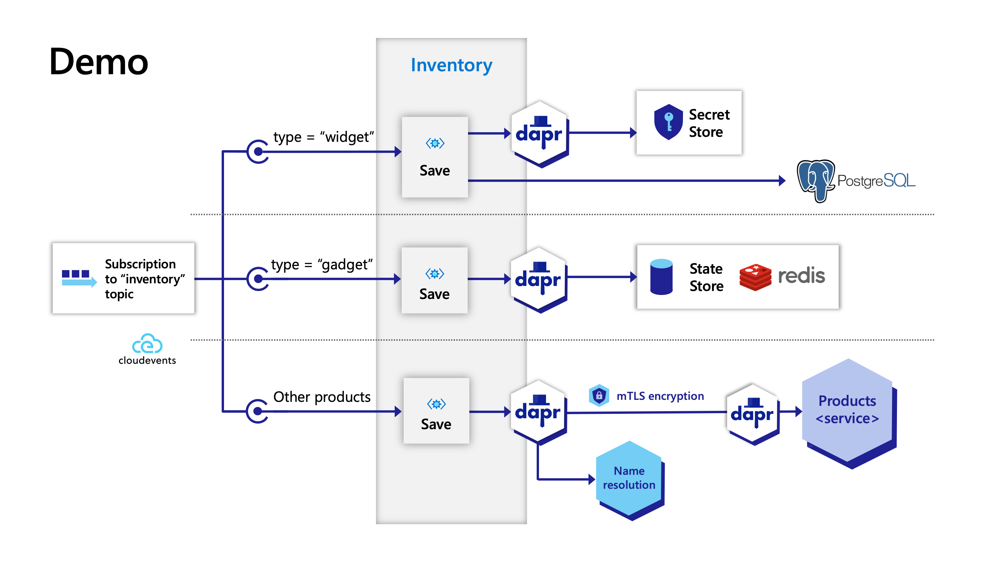

# From Zero to Hero with Go and Dapr

[Slides](slides.pdf)

This is a Go application demonstrating the key features of [Dapr](https://dapr.io) with a few different approaches. My goal is to help you pick the best fit for your needs and level up as a microservices developer.

Dapr, at its core, is a set of building block APIs that abstract away common tasks so you can focus on what matters most-- business value/features. We will focus on the building blocks that I consider as the most useful for Go developers.

* Publish / Subscribe (with routing)
* Secret store
* State store
* Service Invocation (with discovery and tracing)

## Design choices

When building Go microservices, we have many choices to make! gRPC, REST or both? Which HTTP router? How to organize packges?

In this application, packages are organized by purpose/feature. This creates a small hurdle for subscriptions because your application [responds with all of the topics in a single callback](https://docs.dapr.io/developing-applications/building-blocks/pubsub/howto-publish-subscribe/#step-2-subscribe-to-topics). To work around this, the subscriptions from each package are merged together into a single response.

You will find examples of "helper code" like this in `pkg/dapr`. However, be aware that the [Go SDK](https://github.com/dapr/go-sdk) is an abstraction over all of the Dapr APIs. It is up to you to decide on custom code or the SDK.

The Go SDK uses the [standard net/http package](https://pkg.go.dev/net/http). To be different, I choose [Fiber](https://gofiber.io/) as the HTTP router for public API traffic and found it to be straightforward to use.

Event callbacks, such as PubSub events, should be considered private communication. Because of this, I highly recommend having Dapr callbacks listen on a separate port that is not publicly exposed. Even better, it should only listen on the loopback interface.

## Application flow

With the design decisions out of the way, let's look at the scenarios and specifically how the Dapr building blocks are used.

There are three code paths. Each starts with the receipt of a Pub/Sub event. By default, Dapr uses [CloudEvents](https://cloudevents.io/) envelopes to encapsulate event data. This allows Dapr to attach tracing IDs and [route the event](https://docs.dapr.io/developing-applications/building-blocks/pubsub/howto-route-messages/) based on attributes such as type.

The application is an Inventory service, where products are persisted in different stores based on type. `Widgets` are stored in a PostgreSQL database. `Gadgets` are stored in a State store, such as Redis or MongoDB. All other product types are stored in a separate service exposed through gRPC.



By inspecting `event.type`, Dapr selects one of three routes (URIs) to invoke.

To connect to the PostgreSQL database, the application uses a Secret Store to acquire the needed credentials in order to connect. From there, the [jackc/pgx](https://github.com/jackc/pgx) package is used to execute SQL statements.

Gadgets are saved simply by calling the "Save state" operation of the [State management API](https://docs.dapr.io/reference/api/state_api/).

Finally, general products are stored in the Products gRPC service. The developer uses the generated gRPC client as normal; however, the endpoint is the Dapr sidecar and an additional `dapr-app-id` metadata field is attached to the request so Dapr know how to route the request. See this [How-To](https://docs.dapr.io/developing-applications/building-blocks/service-invocation/howto-invoke-services-grpc/) for more details.

All component configurations are located in the `components` directory. The main Dapr configuration is in `config.yaml` and is where tracing and preview features are enabled.

## Running the demo

After running `dapr init`, you should have Redis running in a Docker container. You will need to create a PostgreSQL database and update `secrets.json` accordingly. Then create the `widgets` table from `tables.sql`.

I launched Postgres in a container and used [pgAdmin](https://www.pgadmin.org) to create the `golang+dapr` database and `widgets` table.

```shell
docker run --name postgres -e POSTGRES_PASSWORD=postgres -p 5432:5432 -d postgres
```

**Start the Products service**

```shell
make run-products
```

**Start the main Inventory service**

In a second terminal run: (_Pick the client mode_)

```shell
make run-custom-http
make run-custom-grpc
make run-sdk-http
make run-sdk-grpc
```

**Send product events**

In a third terminal you can publish the 3 product event types. The contents of each message are located in the `messages` directory.

Send a Widget: This will save in the PostgreSQL database.

```shell
make send-widget
```

Send a Gadget: This will save in the Redis state store.

```shell
make send-gadget
```

Send a Thingamajig: This will invoke the Products service using Dapr for service discovery and mTLS authentication.

```shell
make send-thingamajig
```

That's it!

I hope this was helpful! If you have better ways of handling anything in this sample, please submit a PR! :)
